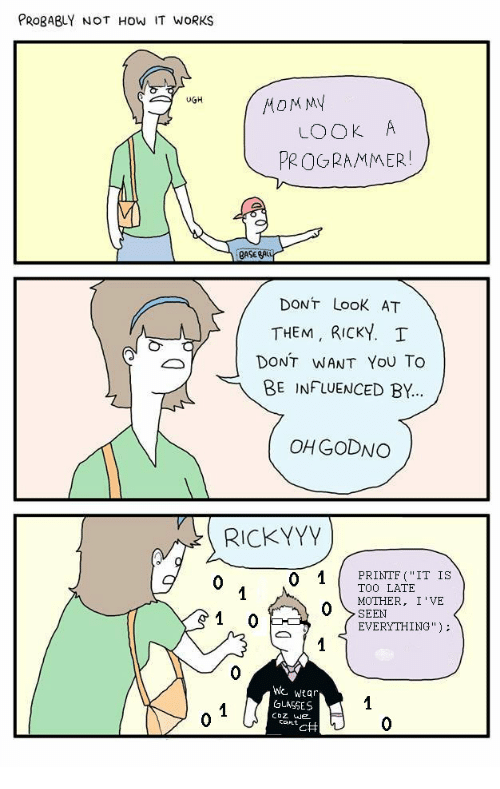

# general setup

```sh
# ssh
ssh-keygen -t ed25519 -C '108883+taylorzr@users.noreply.github.com'
eval "$(ssh-agent -s)"
ssh-add ~/.ssh/id_ed25519
cat ~/.ssh/id_ed25519.pub

# dotfiles
git clone git@github.com:taylorzr/dotfiles.git
cd dotfiles
just stow

# install stuff
zsh kitty neovim fzf jq ripgrep golang
git clone git@github.com:taylorzr/kitty-meow.git ~/.config/kitty/meow
/bin/bash -c "$(curl -fsSL https://raw.githubusercontent.com/Homebrew/install/HEAD/install.sh)"
$(brew --prefix)/opt/fzf/install

# maybe install stuff
yq tldr gomplate pinentry-mac

# generate gpg keys

$ gpg --full-generate-key
# choose: rsa & 4096

$ gpg --list-secret-keys --keyid-format=short
# copy sec id

# then export public key, copy and save in github
gpg --armor --export <key-id>

# postgres
initdb
brew services start postgresql
createdb $USER

# other software
rectangle, pastebot, pinentry-mac
rancher (includes kubectl, helm, nerdctl, “docker“, etc), kubectx, k9s
tfenv, then tfenv install
```

# fedora

```sh
# tools
sudo dnf group install "Development Tools" "C Development Tools and Libraries"

# discord
flatpak remote-add --if-not-exists flathub https://flathub.org/repo/flathub.flatpakrepo
flatpak install com.discordapp.Discord

# hashi stuff
sudo dnf install -y dnf-plugins-core
sudo dnf config-manager --add-repo https://rpm.releases.hashicorp.com/fedora/hashicorp.repo
sudo dnf -y install terraform vault

# snaps
sudo dnf install snapd
sudo snap install bw yq

# go installs
go install github.com/derailed/k9s@latest # snap didn't work right
go install github.com/hairyhenderson/gomplate/v4/cmd/gomplate@latest

# aws & k8s
 https://docs.aws.amazon.com/cli/latest/userguide/getting-started-install.html
install krew -> https://krew.sigs.k8s.io/docs/user-guide/setup/install/
krew for kubectl ctx & ns
```

### Key repeat speed

```
# After setting anything run:
#   killall SystemUIServer
# normal initial minimum is 25 (225 ms)
# normal repeat minimum is 6 (30 ms)
defaults write -g InitialKeyRepeat -int 15
defaults write -g KeyRepeat -int 2
defaults write com.apple.finder AppleShowAllFiles YES
defaults write com.apple.screencapture location $HOME/Downloads
```

### Manual stuff, maybe figure out how to do this in terminal someday

- unset mission control re-arrange desktops
- unset key shortcuts ctrl-up and ctrl-down
